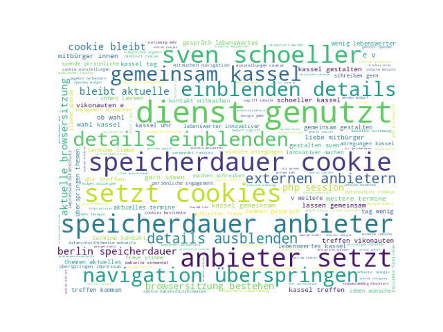
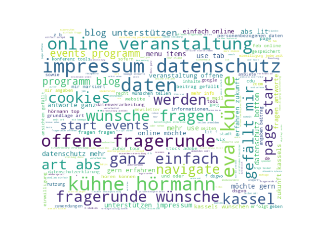
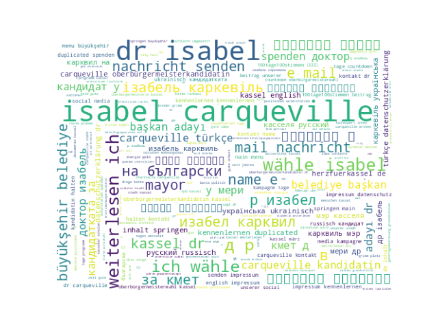
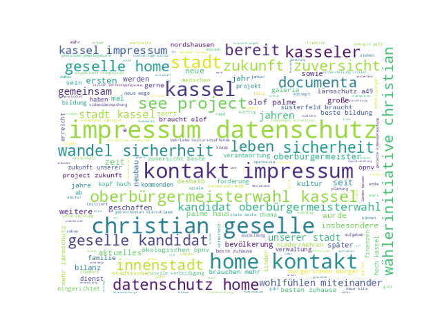

# Analyse der Webseite der OB Kandidat:innen Kassel 2023

Um Ergebnisse zu reproduzieren, muss python 3 installiert sein. Die benötigten Pakete können mit `pip install -r requirements.txt` installiert werden. Die Analyse kann mit `python run.py` gestartet werden.

## Ergebnisse Anzahl Erwähnungen "Wirtschaft"

### Sven Schoeller

https://www.sven-schoeller.de/datenschutz
2

Sven Schoeller hat 2 Erwähnungen 'Wirtschaft' und 6903 Wörter auf der Website

### Eva Kühne-Hörmann

https://www.eva-kuehne-hoermann.de/klima-und-umweltschutz
3

Eva Kühne-Hörmann hat 3 Erwähnungen 'Wirtschaft' und 10366 Wörter auf der Website

### Dr. Isabel Carqueville

https://herzfuerkassel.de/#unterstuetzen
9

https://herzfuerkassel.de/#positionen
9

https://herzfuerkassel.de/#100tage
9

https://herzfuerkassel.de/dr-isabel-carqueville-for-mayor-of-kassel-2023/
1

https://herzfuerkassel.de/
9

Dr. Isabel Carqueville hat 37 Erwähnungen 'Wirtschaft' und 22567 Wörter auf der Website

### Violetta Bock

https://www.violetta-bock.de/haushaltsrede-von-violetta-bock/
2

Violetta Bock hat 2 Erwähnungen 'Wirtschaft' und 28589 Wörter auf der Website

### Christian Geselle

https://christian-geselle.de/2022/12/12/meine-bilanz/
3

https://christian-geselle.de/portfolio/item/durch-gemeinsame-gewerbegebiete/
4

https://christian-geselle.de/portfolio/item/durch-vielseitige-kultur/
1

Christian Geselle hat 8 Erwähnungen 'Wirtschaft' und 9358 Wörter auf der Website
