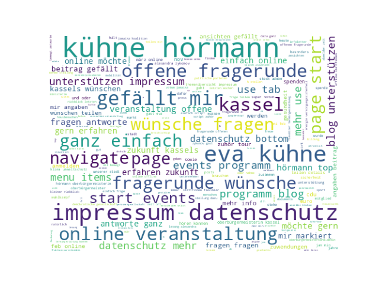
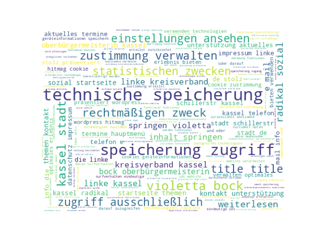

# Analyse der Webseite der OB Kandidat:innen Kassel 2023

Um Ergebnisse zu reproduzieren, muss python 3 installiert sein. Die benötigten Pakete können mit `pip install -r requirements.txt` installiert werden. Die Analyse kann mit `python run.py` gestartet werden.

## Ergebnisse Anzahl Erwähnungen "Wirtschaft"

### Sven Schoeller

https://www.sven-schoeller.de/ob-wahl-kassel/termine/podiumsdiskussion-der-wirtschaftsjunioren-der-ihk
Anzahl Wirtschaft: 4
https://www.sven-schoeller.de/ob-wahl-kassel/termine/firmenbesuch-mit-tarek-al-wazir-und-omid-nouripour
Anzahl Wirtschaft: 1
https://www.sven-schoeller.de/ob-wahl-kassel/termine/neujahrsempfang
Anzahl Wirtschaft: 1
https://www.sven-schoeller.de/oberbuergermeister-wahl-kassel-2023/aktuelles/beduerfnisse-von-seniorinnen-und-senioren-im-blick-behalten
Anzahl digital: 4
https://www.sven-schoeller.de/oberbuergermeister-wahl-kassel-2023/aktuelles/kassel-sollte-partnerschaft-mit-ukrainischer-stadt-eingehen
Anzahl Wirtschaft: 1
https://www.sven-schoeller.de/oberbuergermeister-wahl-kassel-2023/aktuelles/wahl-zum-oberbuergermeisterkandidaten-auf-der-kmv
Anzahl Wirtschaft: 1
https://www.sven-schoeller.de/oberbuergermeister-fuer-kassel
Anzahl Wirtschaft: 9
https://www.sven-schoeller.de/oberbuergermeister-fuer-kassel
Anzahl digital: 8
https://www.sven-schoeller.de/oberbuergermeister-kandidat-kassel
Anzahl Wirtschaft: 2
https://www.sven-schoeller.de/oberbuergermeisterwahl-kassel-termine
Anzahl Wirtschaft: 1

Schoeller hat 20 Erwähnungen 'Wirtschaft', 12 Erwähnungen 'digital' und 34154 Wörter auf der Website

### Eva Kühne-Hörmann

https://www.eva-kuehne-hoermann.de/wahlkampf-eva-kuehne-hoermann-unterstuetzen
Anzahl digital: 1
https://www.eva-kuehne-hoermann.de/klima-und-umweltschutz
Anzahl Wirtschaft: 3

Hoermann hat 3 Erwähnungen 'Wirtschaft', 1 Erwähnungen 'digital' und 5684 Wörter auf der Website

### Dr. Isabel Carqueville

https://herzfuerkassel.de/#unterstuetzen
Anzahl Wirtschaft: 14
https://herzfuerkassel.de/#positionen
Anzahl Wirtschaft: 14
https://herzfuerkassel.de/#100tage
Anzahl Wirtschaft: 14
https://herzfuerkassel.de/dr-isabel-carqueville-for-mayor-of-kassel-2023/
Anzahl Wirtschaft: 1
https://herzfuerkassel.de/
Anzahl Wirtschaft: 14
https://herzfuerkassel.de/100-stimmen/48-jenny-mayerhofer/
Anzahl Wirtschaft: 1
https://herzfuerkassel.de/100-stimmen/47-christian-unverzagt/
Anzahl digital: 1
https://herzfuerkassel.de/100-stimmen/37-maurice-riesche/
Anzahl Wirtschaft: 1
https://herzfuerkassel.de/100-stimmen/31-sebastian-fiedler/
Anzahl digital: 1
https://herzfuerkassel.de/100-stimmen/23-peter-carqueville/
Anzahl Wirtschaft: 1
https://herzfuerkassel.de/100-stimmen/14-moritz-butt/
Anzahl digital: 1
https://herzfuerkassel.de/100-stimmen/10-steffen-hunold/
Anzahl Wirtschaft: 1

Carqueville hat 61 (effektiv 19 aufgrund doppelter Zählung) Erwähnungen 'Wirtschaft', 3 Erwähnungen 'digital' und 34959 Wörter auf der Website

### Violetta Bock

https://www.violetta-bock.de/category/aktuelles/
Anzahl Wirtschaft: 1
https://www.violetta-bock.de/radikal-sozial-wir-alle-sind-kassel/
Anzahl digital: 1
https://www.violetta-bock.de/author/jens/
Anzahl Wirtschaft: 1

Bock hat 2 Erwähnungen 'Wirtschaft', 1 Erwähnungen 'digital' und 19495 Wörter auf der Website

### Christian Geselle

https://christian-geselle.de/2022/12/12/meine-bilanz/
Anzahl Wirtschaft: 3
https://christian-geselle.de/2022/12/12/meine-bilanz/
Anzahl digital: 3
https://christian-geselle.de/portfolio/item/durch-gemeinsame-gewerbegebiete/
Anzahl Wirtschaft: 4
https://christian-geselle.de/portfolio/item/durch-vielseitige-kultur/
Anzahl Wirtschaft: 1

Geselle hat 8 Erwähnungen 'Wirtschaft', 3 Erwähnungen 'digital' und 5729 Wörter auf der Website